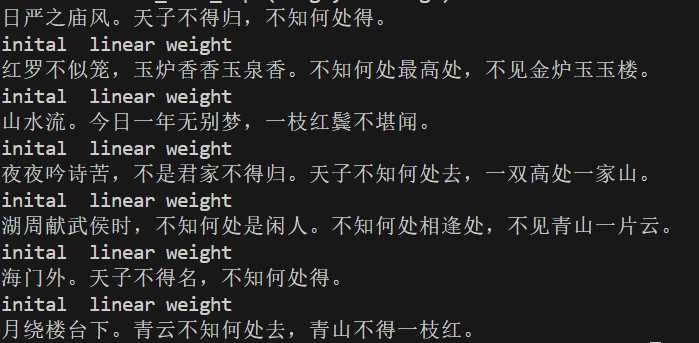

# 1 代码补全
完成pytorch版本

# 2 模型解释 
RNN（循环神经网络）
核心思想
目标：处理序列数据（如文本、时间序列），捕捉时间步之间的依赖关系。
机制：通过隐藏状态传递历史信息，每个时间步的输入结合当前数据和前一时刻的隐藏状态。
优点
简单易实现，适合短序列任务。
缺点
长序列训练时，梯度可能指数级衰减或爆炸；并且难以捕捉长距离依赖。

LSTM（长短期记忆网络）
核心思想
目标：解决 RNN 的长期依赖问题，通过门控机制控制信息流。
关键组件：
遗忘门（Forget Gate）：决定丢弃哪些历史信息。
输入门（Input Gate）：决定存储哪些新信息。
输出门（Output Gate）：决定当前隐藏状态的输出。
优点
长期记忆能力显著增强，适合长序列任务；梯度传递更稳定。
缺点
参数较多，计算成本较高。

GRU（门控循环单元）
核心思想
目标：简化 LSTM，减少参数量的同时保持相似性能。
关键组件：
重置门（Reset Gate）：控制前一状态对当前候选状态的影响。
更新门（Update Gate）：平衡历史状态和新候选状态。
优点
参数比 LSTM 少，训练更快，且在多数任务中与 LSTM 性能相当。
缺点
对极长序列的建模能力略逊于 LSTM。

# 3 诗歌生成过程

### 数据处理阶段
1. 数据清洗与格式化
从poems.txt读取原始诗歌数据，过滤包含特殊符号（《、[ 等）的诗歌，去除空格保留标点，添加起止标记：start_token = 'G'，end_token = 'E'，并且规范诗歌长度（5-80字符）
2. 词典构建
遍历所有预处理后的诗歌文本，逐字拆解形成原始字符集合，包括：添加特殊控制符：起始符G和终止符E，保留有效汉字及标点符号，过滤空白符和非法符号。使用计数工具统计每个字符的出现频次，生成(字符, 频次)的元组列表，高频字符通常承载更多语义信息，此步骤为后续词表裁剪提供依据。按频次降序排列字符列表，根据预设词表容量截取高频字符，保留阈值外的低频字可统一归为未登录词（如空格符），确保词表覆盖训练数据主体。最后为最终词表中每个字符分配唯一ID：起始符G固定为0，终止符E设为最大ID，并按频率排序依次赋予1,2,3...

### 模型训练
1. 嵌入层
随机初始化100维词向量，输入形状(batch_size, seq_len)，输出形状(batch_size, seq_len, 100)

1. 双层LSTM核心
~~~
self.rnn_lstm = nn.LSTM(
    input_size=...,    # 与嵌入维度一致
    hidden_size=...,   # 隐层维度
    num_layers=2,      # 堆叠两层
    batch_first=True   # 输入格式为(batch,seq,feature)
)
~~~
1. 输出层
全连接层：128 → vocab_size，LogSoftmax：生成概率分布

### 诗歌生成机制
用户输入起始字，如日、月、湖、海等，当前序列输入模型，获取最后一个时间步的概率分布，选择最高概率字追加到诗句，当生成结束符'E'或超过30字强制终止

## 4 训练结果
